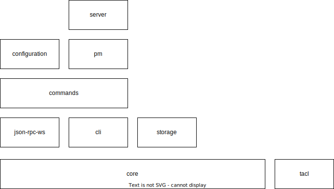

Akala is a framework that aims to provide kind of a mix between [angular](https://angular.io), [redux](https://redux.js.org), [uci](https://openwrt.org/docs/guide-user/base-system/uci) and [pm2](https://pm2.io/).

It is composed of multiple layers 
- [jsonrpc](jsonrpc): base communication layer (obviously other protocols can be used, but this one is the firstclass choice.
- [core](core): base layer containing all necessary implementations for subsequent layers: modules, dependency injection, 2way data binding, ...
- [commands](commands): base layer to implement a redux-like system.
- [configuration](configuration): on top of commands, sits the configuration layer. It has various way to control configuration content, so could be used without commands, but having commands implementation makes it depending on commands layer.
- [storage](storage): storage layer is my vision of an ORM in javascript. (currently not many providers are supported, but it might grow in the future).

Up to here, all previously mentioned layers are usable from either client or server side (understand browser or nodejs). Then comes the platform specific layers.
- [pm](pm): process manager. It says it all: this layer is a docker like system which you can control using the [commands](commands) layer. Each process can be started with its own arguments (like a docker container).
- [server](server): node layer. It basically supports server side command triggers like http (This permits to have commands being served by http).
- [client](client): browser layer heavily inspired from angularjs and angular from a concept perspective, but with a radically different usage approach. 

